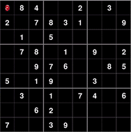
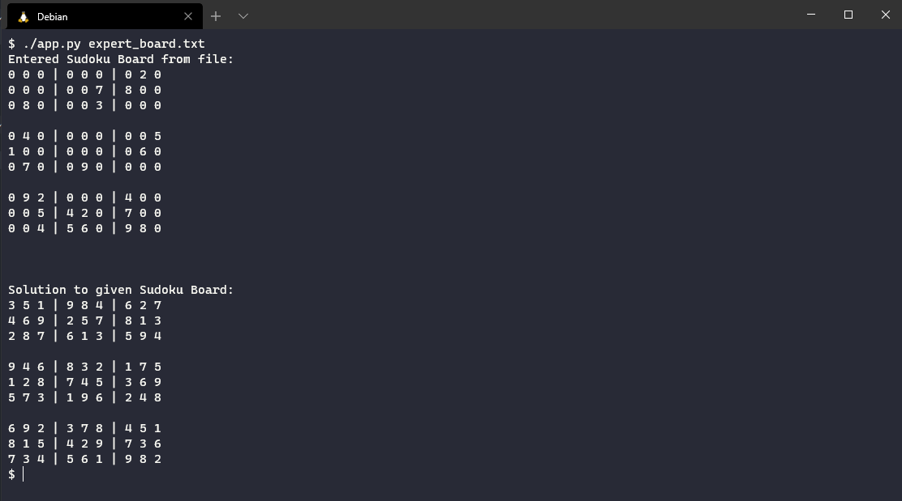

SudoSolver
------------------
A Sudoku Game Solver developed using recursive backtracking. There are two revisions of the solver, one printing text to a console, and a visualized revision using pygame

Requirements
------------------
In order to use the visualized revision of the application you must install pygame.
After installing pygame run the visualized.py file with python

Images
------------------

